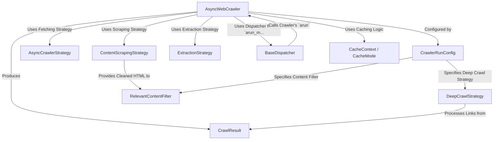

# Tutorial: Crawl4AI

`Crawl4AI` is a flexible Python library for *asynchronously crawling websites* and *extracting structured content*, specifically designed for **AI use cases**.
You primarily interact with the `AsyncWebCrawler`, which acts as the main coordinator. You provide it with URLs and a `CrawlerRunConfig` detailing *how* to crawl (e.g., using specific strategies for fetching, scraping, filtering, and extraction).
It can handle single pages or multiple URLs concurrently using a `BaseDispatcher`, optionally crawl deeper by following links via `DeepCrawlStrategy`, manage `CacheMode`, and apply `RelevantContentFilter` before finally returning a `CrawlResult` containing all the gathered data.

**Source Repository:** [https://github.com/unclecode/crawl4ai/tree/9c58e4ce2ee025debd3f36bf213330bd72b90e46/crawl4ai](https://github.com/unclecode/crawl4ai/tree/9c58e4ce2ee025debd3f36bf213330bd72b90e46/crawl4ai)

## Chapters

1. [AsyncCrawlerStrategy](01_asynccrawlerstrategy.md)
2. [AsyncWebCrawler](02_asyncwebcrawler.md)
3. [CrawlerRunConfig](03_crawlerrunconfig.md)
4. [ContentScrapingStrategy](04_contentscrapingstrategy.md)
5. [RelevantContentFilter](05_relevantcontentfilter.md)
6. [ExtractionStrategy](06_extractionstrategy.md)
7. [CrawlResult](07_crawlresult.md)
8. [DeepCrawlStrategy](08_deepcrawlstrategy.md)
9. [CacheContext / CacheMode](09_cachecontext___cachemode.md)
10. [BaseDispatcher](10_basedispatcher.md)

---

Generated by [AI Codebase Knowledge Builder](https://github.com/The-Pocket/Tutorial-Codebase-Knowledge)