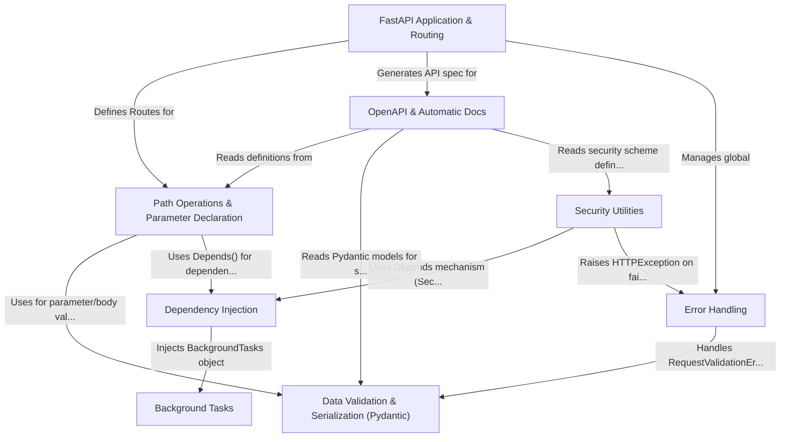

# Tutorial: FastAPI

FastAPI is a modern, *high-performance* web framework for building APIs with Python.
It's designed to be **easy to use**, fast to code, and ready for production.
Key features include **automatic data validation** (using Pydantic), **dependency injection**, and **automatic interactive API documentation** (OpenAPI and Swagger UI).

**Source Repository:** [https://github.com/fastapi/fastapi/tree/628c34e0cae200564d191c95d7edea78c88c4b5e/fastapi](https://github.com/fastapi/fastapi/tree/628c34e0cae200564d191c95d7edea78c88c4b5e/fastapi)

## Chapters

1. [FastAPI Application & Routing](01_fastapi_application___routing.md)
2. [Path Operations & Parameter Declaration](02_path_operations___parameter_declaration.md)
3. [Data Validation & Serialization (Pydantic)](03_data_validation___serialization__pydantic_.md)
4. [OpenAPI & Automatic Docs](04_openapi___automatic_docs.md)
5. [Dependency Injection](05_dependency_injection.md)
6. [Error Handling](06_error_handling.md)
7. [Security Utilities](07_security_utilities.md)
8. [Background Tasks](08_background_tasks.md)

---

Generated by [AI Codebase Knowledge Builder](https://github.com/The-Pocket/Tutorial-Codebase-Knowledge)