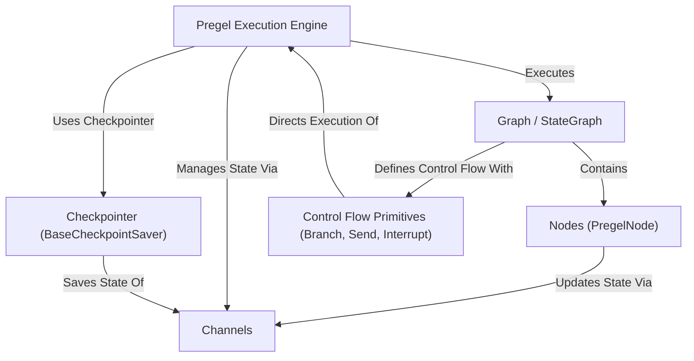

# Tutorial: LangGraph

LangGraph helps you build complex **stateful applications**, like chatbots or agents, using a *graph-based approach*.
You define your application's logic as a series of steps (**Nodes**) connected by transitions (**Edges**) in a **Graph**.
The system manages the application's *shared state* using **Channels** and executes the graph step-by-step with its **Pregel engine**, handling things like branching, interruptions, and saving progress (**Checkpointing**).

**Source Repository:** [https://github.com/langchain-ai/langgraph/tree/55f922cf2f3e63600ed8f0d0cd1262a75a991fdc/libs/langgraph/langgraph](https://github.com/langchain-ai/langgraph/tree/55f922cf2f3e63600ed8f0d0cd1262a75a991fdc/libs/langgraph/langgraph)

## Chapters

1. [Graph / StateGraph](01_graph___stategraph.md)
2. [Nodes (`PregelNode`)](02_nodes___pregelnode__.md)
3. [Channels](03_channels.md)
4. [Control Flow Primitives (`Branch`, `Send`, `Interrupt`)](04_control_flow_primitives___branch____send____interrupt__.md)
5. [Pregel Execution Engine](05_pregel_execution_engine.md)
6. [Checkpointer (`BaseCheckpointSaver`)](06_checkpointer___basecheckpointsaver__.md)

---

Generated by [AI Codebase Knowledge Builder](https://github.com/The-Pocket/Tutorial-Codebase-Knowledge)
