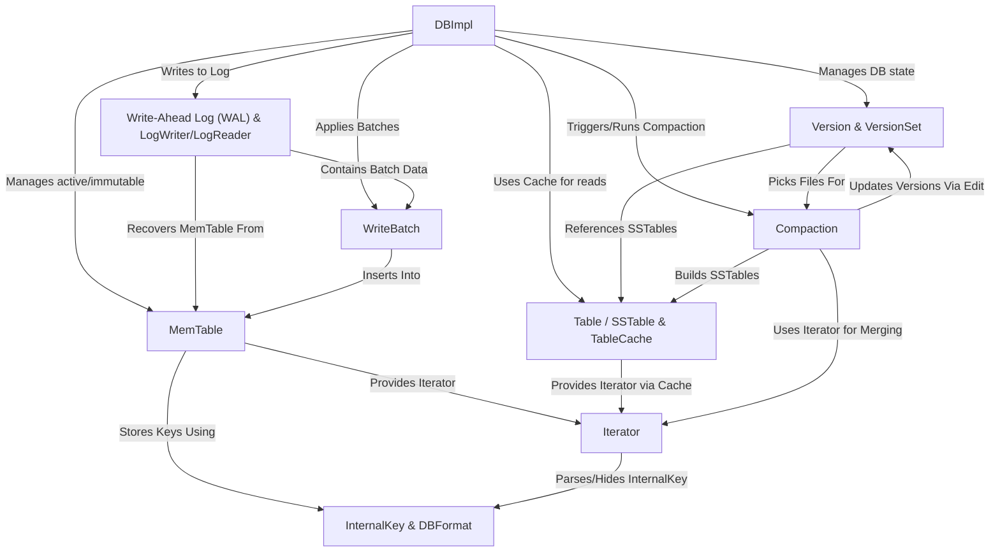

# Tutorial: LevelDB

LevelDB is a fast *key-value storage library* written at Google.
Think of it like a simple database where you store pieces of data (values) associated with unique names (keys).
It's designed to be **very fast** for both writing new data and reading existing data, and it reliably stores everything on **disk**.
It uses a *log-structured merge-tree (LSM-tree)* design to achieve high write performance and manages data in sorted files (*SSTables*) across different levels for efficient reads and space management.

**Source Repository:** [https://github.com/google/leveldb/tree/main/db](https://github.com/google/leveldb/tree/main/db)

## Chapters

1. [Table / SSTable & TableCache](01_table___sstable___tablecache.md)
2. [MemTable](02_memtable.md)
3. [Write-Ahead Log (WAL) & LogWriter/LogReader](03_write_ahead_log__wal____logwriter_logreader.md)
4. [DBImpl](04_dbimpl.md)
5. [WriteBatch](05_writebatch.md)
6. [Version & VersionSet](06_version___versionset.md)
7. [Iterator](07_iterator.md)
8. [Compaction](08_compaction.md)
9. [InternalKey & DBFormat](09_internalkey___dbformat.md)

---

Generated by [AI Codebase Knowledge Builder](https://github.com/The-Pocket/Tutorial-Codebase-Knowledge)
