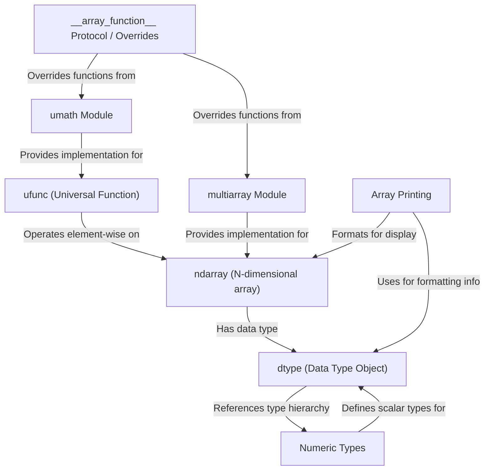

# Tutorial: NumPy Core

NumPy provides the powerful **ndarray** object, a *multi-dimensional grid* optimized for numerical computations on large datasets. It uses **dtypes** (data type objects) to precisely define the *kind of data* (like integers or floating-point numbers) stored within an array, ensuring memory efficiency and enabling optimized low-level operations. NumPy also features **ufuncs** (universal functions), which are functions like `add` or `sin` designed to operate *element-wise* on entire arrays very quickly, leveraging compiled code. Together, these components form the foundation for high-performance scientific computing in Python.

**Source Repository:** [https://github.com/numpy/numpy/tree/3b377854e8b1a55f15bda6f1166fe9954828231b/numpy/_core](https://github.com/numpy/numpy/tree/3b377854e8b1a55f15bda6f1166fe9954828231b/numpy/_core)

## Chapters

1. [ndarray (N-dimensional array)](01_ndarray__n_dimensional_array_.md)
2. [dtype (Data Type Object)](02_dtype__data_type_object_.md)
3. [ufunc (Universal Function)](03_ufunc__universal_function_.md)
4. [Numeric Types (`numerictypes`)](04_numeric_types___numerictypes__.md)
5. [Array Printing (`arrayprint`)](05_array_printing___arrayprint__.md)
6. [multiarray Module](06_multiarray_module.md)
7. [umath Module](07_umath_module.md)
8. [__array_function__ Protocol / Overrides (`overrides`)](08___array_function___protocol___overrides___overrides__.md)

---

Generated by [AI Codebase Knowledge Builder](https://github.com/The-Pocket/Tutorial-Codebase-Knowledge)
