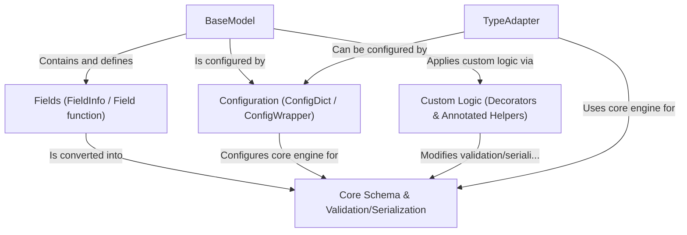

# Tutorial: Pydantic Core

Pydantic Core provides the fundamental machinery for **data validation**, **parsing**, and **serialization** in Pydantic. It takes Python *type hints* and uses them to define how data should be structured and processed. Users typically interact with it by defining classes that inherit from `BaseModel`, which automatically gets validation and serialization capabilities based on its annotated fields. Pydantic Core ensures data conforms to the defined types and allows converting between Python objects and formats like JSON efficiently, leveraging Rust for performance.

**Source Repository:** [https://github.com/pydantic/pydantic/tree/6c38dc93f40a47f4d1350adca9ec0d72502e223f/pydantic](https://github.com/pydantic/pydantic/tree/6c38dc93f40a47f4d1350adca9ec0d72502e223f/pydantic)

## Chapters

1. [BaseModel](01_basemodel.md)
2. [Fields (FieldInfo / Field function)](02_fields__fieldinfo___field_function_.md)
3. [Configuration (ConfigDict / ConfigWrapper)](03_configuration__configdict___configwrapper_.md)
4. [Custom Logic (Decorators & Annotated Helpers)](04_custom_logic__decorators___annotated_helpers_.md)
5. [Core Schema & Validation/Serialization](05_core_schema___validation_serialization.md)
6. [TypeAdapter](06_typeadapter.md)

---

Generated by [AI Codebase Knowledge Builder](https://github.com/The-Pocket/Tutorial-Codebase-Knowledge)