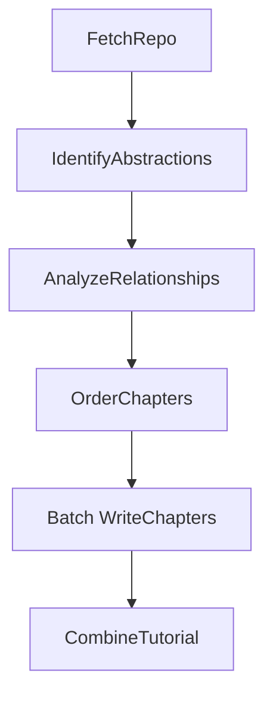

# System Design: Codebase Knowledge Builder

> Please DON'T remove notes for AI

## Requirements

> Notes for AI: Keep it simple and clear.
> If the requirements are abstract, write concrete user stories

**User Story:** As a developer onboarding to a new codebase, I want a tutorial automatically generated from its GitHub repository. This tutorial should explain the core abstractions, their relationships (visualized), and how they work together, using beginner-friendly language, analogies, and multi-line descriptions where needed, so I can understand the project structure and key concepts quickly without manually digging through all the code.

**Input:**
- A publicly accessible GitHub repository URL.
- A project name (optional, will be derived from the URL if not provided).

**Output:**
- A directory named after the project containing:
    - An `index.md` file with:
        - A high-level project summary.
        - A Mermaid flowchart diagram visualizing relationships between abstractions.
        - Textual descriptions of the relationships.
        - An ordered list of links to chapter files.
    - Individual Markdown files for each chapter (`01_chapter_one.md`, `02_chapter_two.md`, etc.) detailing core abstractions in a logical order.

## Flow Design

> Notes for AI:
> 1. Consider the design patterns of agent, map-reduce, rag, and workflow. Apply them if they fit.
> 2. Present a concise, high-level description of the workflow.

### Applicable Design Pattern:

This project primarily uses a **Workflow** pattern to decompose the tutorial generation process into sequential steps. The chapter writing step utilizes a **BatchNode** (a form of MapReduce) to process each abstraction individually.

1.  **Workflow:** The overall process follows a defined sequence: fetch code -> identify abstractions -> analyze relationships -> determine order -> write chapters -> combine tutorial into files.
2.  **Batch Processing:** The `WriteChapters` node processes each identified abstraction independently (map) before the final tutorial files are structured (reduce).

### Flow high-level Design:

1.  **`FetchRepo`**: Crawls the specified GitHub repository path using `crawl_github_files` utility, retrieving relevant source code file contents.
2.  **`IdentifyAbstractions`**: Analyzes the codebase using an LLM to identify up to 10 core abstractions, generate beginner-friendly descriptions (allowing multi-line), and list the *indices* of files related to each abstraction.
3.  **`AnalyzeRelationships`**: Uses an LLM to analyze the identified abstractions (referenced by index) and their related code to generate a high-level project summary and describe the relationships/interactions between these abstractions, specifying *source* and *target* abstraction indices and a concise label for each interaction.
4.  **`OrderChapters`**: Determines the most logical order (as indices) to present the abstractions in the tutorial, likely based on importance or dependencies identified in the previous step.
5.  **`WriteChapters` (BatchNode)**: Iterates through the ordered list of abstraction indices. For each abstraction, it calls an LLM to write a detailed, beginner-friendly chapter, using the relevant code files (accessed via indices) and summaries of previously generated chapters as context.
6.  **`CombineTutorial`**: Creates an output directory, generates a Mermaid diagram from the relationship data, and writes the project summary, relationship diagram/details (in `index.md`), and individually generated chapters (as separate `.md` files, named and ordered according to `chapter_order`) into it.



## Utility Functions

> Notes for AI:
> 1. Understand the utility function definition thoroughly by reviewing the doc.
> 2. Include only the necessary utility functions, based on nodes in the flow.

1.  **`crawl_github_files`** (`utils/crawl_github_files.py`) - *External Dependency: requests*
    *   *Input*: `repo_url` (str), `token` (str, optional), `max_file_size` (int, optional), `use_relative_paths` (bool, optional), `include_patterns` (set, optional), `exclude_patterns` (set, optional)
    *   *Output*: `dict` containing `files` (dict[str, str]) and `stats`.
    *   *Necessity*: Required by `FetchRepo` to download and read the source code from GitHub. Handles cloning logic implicitly via API calls, filtering, and file reading.
2.  **`call_llm`** (`utils/call_llm.py`) - *External Dependency: LLM Provider API (e.g., OpenAI, Anthropic)*
    *   *Input*: `prompt` (str)
    *   *Output*: `response` (str)
    *   *Necessity*: Used by `IdentifyAbstractions`, `AnalyzeRelationships`, `OrderChapters`, and `WriteChapters` for code analysis and content generation. Needs careful prompt engineering and YAML validation (implicit via `yaml.safe_load` which raises errors).

## Node Design

### Shared Store

> Notes for AI: Try to minimize data redundancy

The shared Store structure is organized as follows:

```python
shared = {
    "repo_url": None, # Input: Provided by the user/main script
    "project_name": None, # Input: Optional, derived from repo_url if not provided
    "github_token": None, # Input: Optional, from environment or config
    "files": [], # Output of FetchRepo: List of tuples (file_path: str, file_content: str)
    "abstractions": [], # Output of IdentifyAbstractions: List of {"name": str, "description": str (can be multi-line), "files": [int]} (indices into shared["files"])
    "relationships": { # Output of AnalyzeRelationships
         "summary": None, # Overall project summary (can be multi-line)
         "details": [] # List of {"from": int, "to": int, "label": str} describing relationships between abstraction indices with a concise label.
     },
    "chapter_order": [], # Output of OrderChapters: List of indices into shared["abstractions"], determining tutorial order
    "chapters": [], # Output of WriteChapters: List of chapter content strings (Markdown), ordered according to chapter_order
    "output_dir": "output", # Input/Default: Base directory for output
    "final_output_dir": None # Output of CombineTutorial: Path to the final generated tutorial directory (e.g., "output/my_project")
}
```

### Node Steps

> Notes for AI: Carefully decide whether to use Batch/Async Node/Flow. Removed explicit try/except in exec, relying on Node's built-in fault tolerance.

1.  **`FetchRepo`**
    *   *Purpose*: Download the repository code and load relevant files into memory using the crawler utility.
    *   *Type*: Regular
    *   *Steps*:
        *   `prep`: Read `repo_url`, optional `github_token`, `output_dir` from shared store. Define `include_patterns` (e.g., `{"*.py", "*.js", "*.md"}`) and `exclude_patterns` (e.g., `{"*test*", "docs/*"}`). Set `max_file_size` and `use_relative_paths` flags. Determine `project_name` from `repo_url` if not present in shared.
        *   `exec`: Call `crawl_github_files(shared["repo_url"], token=shared["github_token"], include_patterns=..., exclude_patterns=..., max_file_size=..., use_relative_paths=True)`. Convert the resulting `files` dictionary into a list of `(path, content)` tuples.
        *   `post`: Write the list of `files` tuples and the derived `project_name` (if applicable) to the shared store.

2.  **`IdentifyAbstractions`**
    *   *Purpose*: Analyze the code to identify key concepts/abstractions using indices.
    *   *Type*: Regular
    *   *Steps*:
        *   `prep`: Read `files` (list of tuples) from shared store. Create context using `create_llm_context` helper which adds file indices. Format the list of `index # path` for the prompt.
        *   `exec`: Construct a prompt for `call_llm` asking it to identify ~5-10 core abstractions, provide a simple description (allowing multi-line YAML string) for each, and list the relevant *file indices* (e.g., `- 0 # path/to/file.py`). Request YAML list output. Parse and validate the YAML, ensuring indices are within bounds and converting entries like `0 # path...` to just the integer `0`.
        *   `post`: Write the validated list of `abstractions` (e.g., `[{"name": "Node", "description": "...", "files": [0, 3, 5]}, ...]`) containing file *indices* to the shared store.

3.  **`AnalyzeRelationships`**
    *   *Purpose*: Generate a project summary and describe how the identified abstractions interact using indices and concise labels.
    *   *Type*: Regular
    *   *Steps*:
        *   `prep`: Read `abstractions` and `files` from shared store. Format context for the LLM, including abstraction names *and indices*, descriptions, and content snippets from related files (referenced by `index # path` using `get_content_for_indices` helper). Prepare the list of `index # AbstractionName` for the prompt.
        *   `exec`: Construct a prompt for `call_llm` asking for (1) a high-level summary (allowing multi-line YAML string) and (2) a list of relationships, each specifying `from_abstraction` (e.g., `0 # Abstraction1`), `to_abstraction` (e.g., `1 # Abstraction2`), and a concise `label` (string, just a few words). Request structured YAML output. Parse and validate, converting referenced abstractions to indices (`from: 0, to: 1`).
        *   `post`: Parse the LLM response and write the `relationships` dictionary (`{"summary": "...", "details": [{"from": 0, "to": 1, "label": "..."}, ...]}`) with indices to the shared store.

4.  **`OrderChapters`**
    *   *Purpose*: Determine the sequence (as indices) in which abstractions should be presented.
    *   *Type*: Regular
    *   *Steps*:
        *   `prep`: Read `abstractions` and `relationships` from the shared store. Prepare context including the list of `index # AbstractionName` and textual descriptions of relationships referencing indices and using the concise `label`.
        *   `exec`: Construct a prompt for `call_llm` asking it to order the abstractions based on importance, foundational concepts, or dependencies. Request output as an ordered YAML list of `index # AbstractionName`. Parse and validate, extracting only the indices and ensuring all are present exactly once.
        *   `post`: Write the validated ordered list of indices (`chapter_order`) to the shared store.

5.  **`WriteChapters`**
    *   *Purpose*: Generate the detailed content for each chapter of the tutorial.
    *   *Type*: **BatchNode**
    *   *Steps*:
        *   `prep`: Read `chapter_order` (list of indices), `abstractions`, and `files` from shared store. Initialize an empty instance variable `self.chapters_written_so_far`. Return an iterable list where each item corresponds to an *abstraction index* from `chapter_order`. Each item should contain chapter number, abstraction details, and a map of related file content (`{ "idx # path": content }` obtained via `get_content_for_indices`).
        *   `exec(item)`: Construct a prompt for `call_llm`. Ask it to write a beginner-friendly Markdown chapter about the current abstraction. Provide its description. Include a summary of previously written chapters (from `self.chapters_written_so_far`). Provide relevant code snippets (referenced by `index # path`). Add the generated chapter content to `self.chapters_written_so_far` for the next iteration's context. Return the chapter content.
        *   `post(shared, prep_res, exec_res_list)`: `exec_res_list` contains the generated chapter Markdown content strings, ordered correctly. Assign this list directly to `shared["chapters"]`. Clean up `self.chapters_written_so_far`.

6.  **`CombineTutorial`**
    *   *Purpose*: Assemble the final tutorial files, including a Mermaid diagram using concise labels.
    *   *Type*: Regular
    *   *Steps*:
        *   `prep`: Read `project_name`, `relationships`, `chapter_order` (indices), `abstractions`, and `chapters` (list of content) from shared store. Generate a Mermaid `flowchart TD` string based on `relationships["details"]`, using indices to identify nodes and the concise `label` for edges. Construct the content for `index.md` (including summary, Mermaid diagram, textual relationship details using the `label`, and ordered links to chapters derived using `chapter_order` and `abstractions`). Define the output directory path (e.g., `./output_dir/project_name`). Prepare a list of `{ "filename": "01_...", "content": "..." }` for chapters.
        *   `exec`: Create the output directory. Write the generated `index.md` content. Iterate through the prepared chapter file list and write each chapter's content to its corresponding `.md` file in the output directory.
        *   `post`: Write the final `output_dir` path to `shared["final_output_dir"]`. Log completion.
