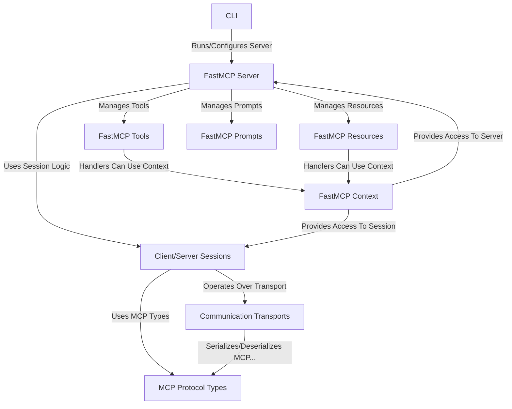

# Tutorial: MCP Python SDK

The **MCP Python SDK** helps developers build applications (clients and servers) that talk to each other using the *Model Context Protocol (MCP)* specification.
It simplifies communication by handling the low-level details like standard **message formats** (Abstraction 0), connection **sessions** (Abstraction 1), and different ways to send/receive data (**transports**, Abstraction 2).
It also provides a high-level framework, **`FastMCP`** (Abstraction 3), making it easy to create servers that expose **tools** (Abstraction 5), **resources** (Abstraction 4), and **prompts** (Abstraction 6) to clients.
The SDK includes **command-line tools** (Abstraction 8) for running and managing these servers.

**Source Repository:** [https://github.com/modelcontextprotocol/python-sdk/tree/d788424caa43599de38cee2f70233282d83e3a34/src/mcp](https://github.com/modelcontextprotocol/python-sdk/tree/d788424caa43599de38cee2f70233282d83e3a34/src/mcp)

## Chapters

1. [CLI (`mcp` command)](01_cli___mcp__command_.md)
2. [FastMCP Server (`FastMCP`)](02_fastmcp_server___fastmcp__.md)
3. [FastMCP Resources (`Resource`, `ResourceManager`)](03_fastmcp_resources___resource____resourcemanager__.md)
4. [FastMCP Tools (`Tool`, `ToolManager`)](04_fastmcp_tools___tool____toolmanager__.md)
5. [FastMCP Prompts (`Prompt`, `PromptManager`)](05_fastmcp_prompts___prompt____promptmanager__.md)
6. [FastMCP Context (`Context`)](06_fastmcp_context___context__.md)
7. [MCP Protocol Types](07_mcp_protocol_types.md)
8. [Client/Server Sessions (`ClientSession`, `ServerSession`)](08_client_server_sessions___clientsession____serversession__.md)
9. [Communication Transports (Stdio, SSE, WebSocket, Memory)](09_communication_transports__stdio__sse__websocket__memory_.md)

---

Generated by [AI Codebase Knowledge Builder](https://github.com/The-Pocket/Tutorial-Codebase-Knowledge)
